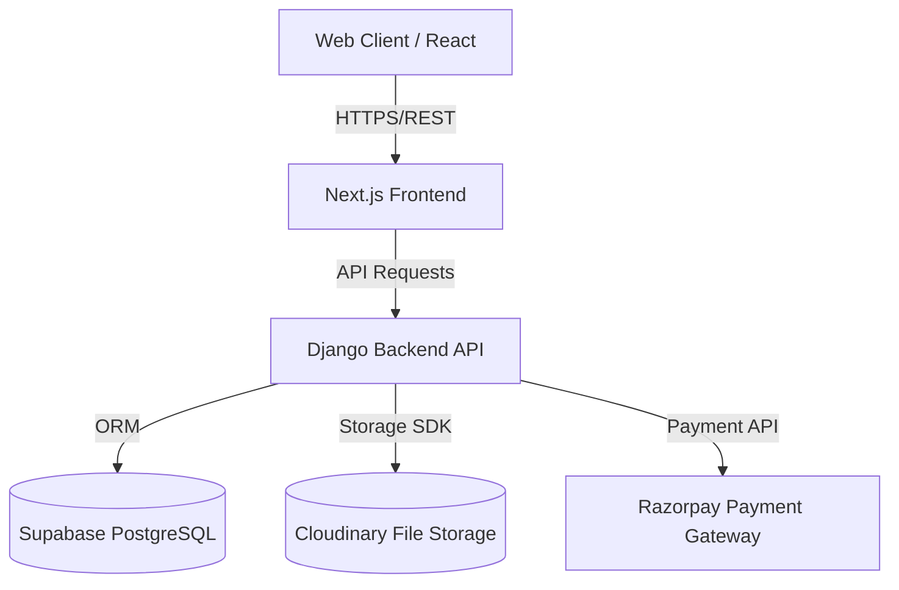
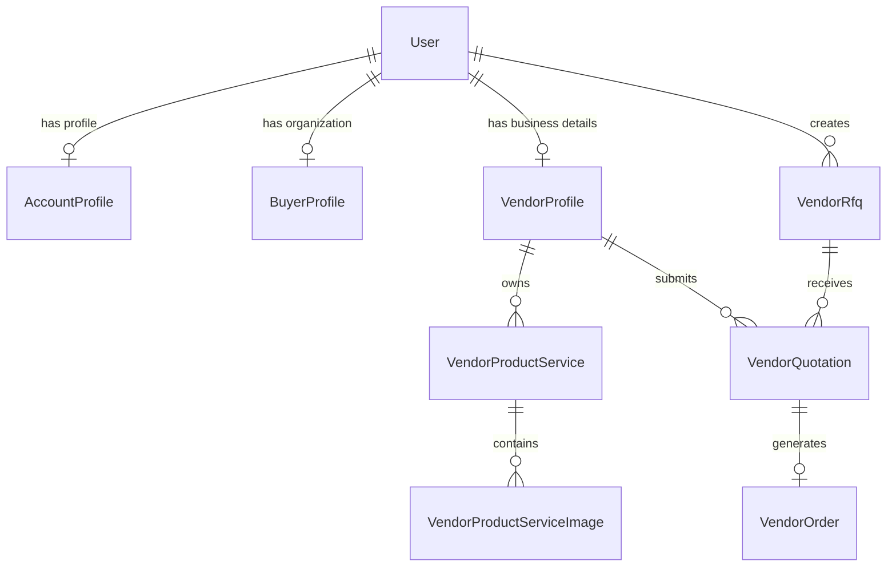

# System Architecture

This document provides a comprehensive overview of the MedVendor Procurement platform's architecture, database design, and key system integrations.

---

## 1. System Overview
MedVendor is a multi-actor B2B medical procurement platform designed to streamline **Request For Quotations (RFQs)**, **Order Orchestration**, **Product/Service Listings**, **In-app Messaging**, and **Razorpay-based Subscription Management**.

The system facilitates secure transactions, audit logs, and status tracking between two main user roles: **Buyers** (Hospitals, Pharmacies, NGOs, Clinics) and **Suppliers/Vendors**.

---

## 2. Technical Stack
The application is split into a decoupled frontend and backend:

*   **Frontend**: 
    *   **Framework**: Next.js (App Router)
    *   **Language**: TypeScript
    *   **Styling**: TailwindCSS & Lucide icons
    *   **Hosting Target**: Vercel
*   **Backend**:
    *   **Framework**: Django & Django REST Framework (DRF)
    *   **Database**: PostgreSQL (Supabase)
    *   **Storage**: Cloudinary (for product images & onboarding documents)
    *   **Payment Gateway**: Razorpay (for subscription payments)
    *   **Hosting Target**: Render

---

## 3. Database Schema

The database model is built on top of Django's native `contrib.auth.models.User` and contains the following custom tables:

### medvendor_account_profiles
Extends the core User model to specify user role and verification status.
*   `user` (One-to-One with User)
*   `role` ("supplier" | "buyer", default "buyer")
*   `status` ("pending" | "approved" | "rejected", default "pending")
*   `buyer_type` ("hospital" | "pharmacy" | "ngo" | "clinic", default "")
*   `created_at` (DateTimeField)

### medvendor_buyer_profiles
Stores detailed organization information for Buyers.
*   `user` (One-to-One with User)
*   `organization_name` (CharField)
*   `buyer_type` (CharField)
*   `gst_number` (CharField)
*   `address` (TextField)
*   `procurement_contact_name` (CharField)
*   `payment_terms` (CharField)
*   `categories_needed` (TextField)

### medvendor_vendor_profiles
Stores detailed business verification details for Suppliers.
*   `user` (One-to-One with User)
*   `company_name` (CharField)
*   `brand_name` (CharField)
*   `gst_number` (CharField)
*   `license_number` (CharField)
*   `business_category` (CharField)
*   `verification_status` ("pending" | "verified" | "rejected")
*   `bank_account_name` / `bank_account_number` / `ifsc_code`

### medvendor_vendor_product_services
Defines the products and services offered by verified Suppliers.
*   `vendor` (ForeignKey to `medvendor_vendor_profiles`)
*   `name` (CharField)
*   `description` (TextField)
*   `product_type` ("product" | "service")
*   `price` (DecimalField)
*   `stock` (IntegerField)
*   `is_active` (BooleanField)

### medvendor_vendor_rfqs
Represents a Request For Quotation created by a Buyer or Supplier (for subcontracting).
*   `buyer` (ForeignKey to User)
*   `title` / `description` (CharField/TextField)
*   `product_type` ("product" | "service")
*   `quantity` (PositiveIntegerField)
*   `target_budget` (DecimalField)
*   `quote_deadline` / `expected_delivery_date` (DateField)
*   `status` ("open" | "under_review" | "awarded" | "closed")
*   `awarded_quote` (ForeignKey to `medvendor_vendor_quotations`)
*   `source_order` (ForeignKey to `medvendor_vendor_orders` - used for subcontracting shortages)

### medvendor_vendor_quotations
Represents a quotation bid submitted by a Supplier.
*   `rfq` (ForeignKey to `medvendor_vendor_rfqs`)
*   `supplier_vendor` (ForeignKey to `medvendor_vendor_profiles`)
*   `product` (ForeignKey to `medvendor_vendor_product_services`)
*   `unit_price` (DecimalField)
*   `lead_time_days` (PositiveIntegerField)
*   `validity_days` (PositiveIntegerField)
*   `status` ("submitted" | "rejected" | "awarded")

### medvendor_vendor_orders
Purchase Orders created after an RFQ award or direct reorder.
*   `buyer` (ForeignKey to User)
*   `vendor` (ForeignKey to `medvendor_vendor_profiles`)
*   `status` ("po_released" | "po_accepted" | "processing" | "partially_subcontracted" | "ready_to_dispatch" | "shipped" | "delivered" | "goods_received" | "completed" | "cancelled")
*   `payment_status` ("pending" | "partially_paid" | "paid" | "overdue" | "payment_requested")
*   `delivery_status` ("not_started" | "loaded" | "in_transit" | "out_for_delivery" | "delivered")
*   `total_amount` (DecimalField)

---

## 4. Architectural Workflows

### System Architecture Flow

### Database ERD Overview

