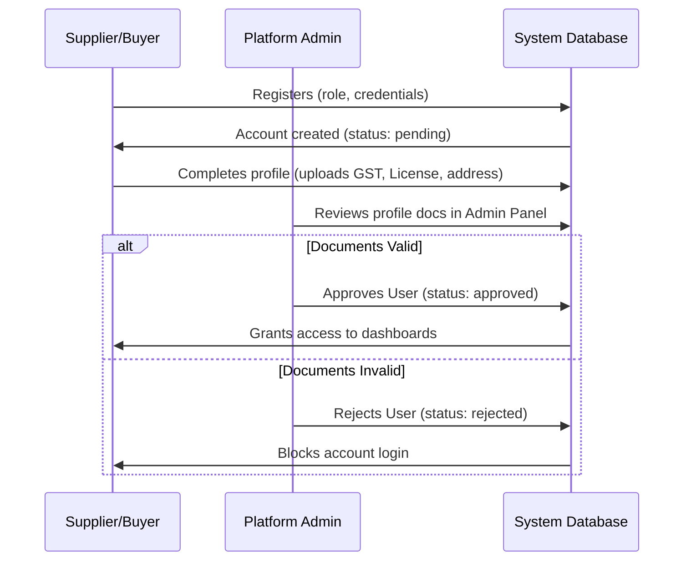
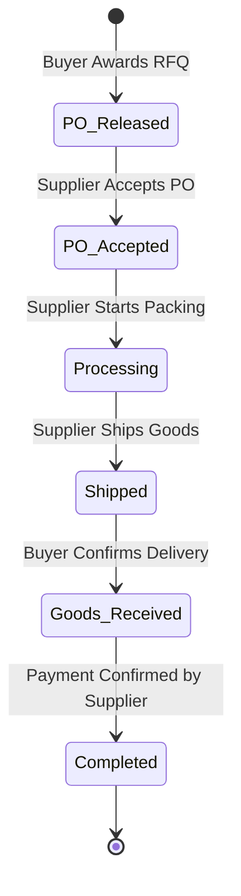

# User Workflows

This document outlines the end-to-end lifecycles and step-by-step procedures for the primary actions performed on the MedVendor platform.

---

## 1. Actor Onboarding Workflow
To ensure platform compliance, all users must complete a structured onboarding and verification pipeline:

1.  **Register**: The user registers on the `/register` page, choosing either the **Supplier** or **Buyer** role.
2.  **Submit Profile Documents**: Upon initial login, they are directed to a profile page. They must fill out organization information, including GST number, and upload licenses or registration documents.
3.  **Admin Review**: A platform administrator logs into `/admin` and views the users list. They review the uploaded documents and click "Approve" or "Reject".
4.  **Verification Bypass**: Once the user is marked `approved`, they bypass the onboarding check and can access their respective workspace page (/buyer or /supplier).

---

## 2. Request For Quotation (RFQ) Lifecycle
Buyers publish RFQs to source supplies, and Suppliers submit bids to fulfill them:

1.  **RFQ Publication**: A verified Buyer creates a procurement request (RFQ), specifying details such as quantity, delivery location, budget, deadline, and tender type (Open or Limited).
2.  **Notification Dispatch**: The platform automatically dispatches notifications to all registered Suppliers, notifying them of a new opportunity.
3.  **Bidding (Quotation Submission)**: Interested Suppliers browse live RFQs and submit quotes. They link their bid to an existing product in their catalog, specify their unit price, delivery lead time, validity, and notes.
4.  **Evaluation**: The Buyer compares the bids in their dashboard. They can reject unviable quotations (providing rejection reasons) or award the RFQ.
5.  **Awarding & Purchase Order Generation**: When the Buyer awards a quotation:
    *   The RFQ status changes to `awarded`.
    *   The quotation status changes to `awarded`.
    *   A Purchase Order (PO) is automatically generated in the `medvendor_vendor_orders` table with status `po_released`.
    *   An email notification is dispatched to the winning supplier containing PO details.

---

## 3. Order Tracking, Logistics & Payment
Once a Purchase Order is generated, both parties track fulfillment, delivery, and payment:

### Fulfillment & Tracking Steps:
1.  **PO Acceptance**: The Supplier views the released PO in `/supplier/orders` and clicks **Accept**. The status changes to `po_accepted`.
2.  **Fulfillment**: The Supplier updates the order status to `processing`.
3.  **Shipment**: Once shipped, the Supplier updates the tracking details, setting status to `shipped`, delivery status to `in_transit`, and adding carrier details/tracking notes.
4.  **Delivery Confirmation**: Upon physical receipt of goods, the Buyer logs in and clicks **Confirm Delivery**. This sets the order status to `goods_received` and delivery status to `delivered`.

### Payment & Closure:
1.  **Payment Request**: The Buyer triggers payment processing and clicks **Submit Payment**. This updates the order payment status to `payment_requested`.
2.  **Payment Confirmation**: The Supplier verifies the receipt of funds and clicks **Confirm Payment**. This sets payment status to `paid`.
3.  **Closeout**: Once both delivery (`delivered`) and payment (`paid`) are verified, the order status transitions to `completed`.
4.  **Reordering**: Buyers can click **Reorder** on any previous order to clone the item list and trigger a new PO instantly.

---

## 4. Supplier Shortage Subcontracting
If a Supplier accepts a PO but encounters inventory shortages, they can subcontract a portion of the order:

1.  **Initiate Subcontract**: The Supplier opens the active order and enters the shortage quantity they cannot fulfill.
2.  **Derived RFQ Generation**: The system creates a new RFQ where the Supplier acts as the "Buyer". This RFQ is marked as a `subcontract` type and links back to the original order.
3.  **Order Flagging**: The original order status changes to `partially_subcontracted`.
4.  **Bidding & Fulfilling**: Other platform suppliers bid on this subcontract RFQ. Once awarded, the sub-order is completed, resolving the supply gap for the main Supplier.
